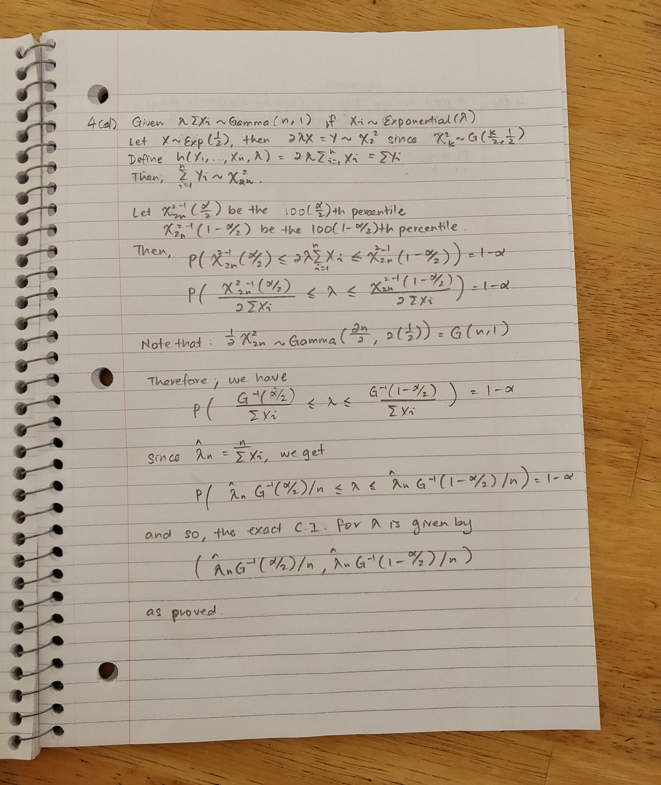

```{r setup, include=FALSE}
knitr::opts_chunk$set(echo = TRUE)
```

# Problem 1

This problem was very straightfoward particularly given the textbook's walk through with the code. We see an estimated correlation coefficent of .5459189. We later find that the bootstrap produces a smaller standard error than the jackknife. The t-interval approach was a little wider than the others and as a result it crossed over zero and contained negative values. This doesn't give us much insight into the time of correlation betweent the two variables. 

We ran more than just the normal theory confidence intervals. We also ran basic and percentile. Using these three  we get confidence intervals that are entirely positive. This makes intuitive sense given we are examining a relationship bewtween LSAT scores and gpa. However, they do drop down to as low as .1 for a lower bound and rise to around .9 for an upper bound. This indicates a positive correlation but gives little insight into the strength of that relationship. See Hw6 01 code for plots and additional information.

# Problem 2

##a. 

The distribution of $\hat{\theta}_{MLE}$ is the distribution of the maximum order statistic. We know the formula for this is $nf(x)F(x)^{n-1}$ plugging in the appropriate values we get that $\hat{\theta}_{MLE}$ follows the distribution $\frac{n}{\theta^n}x_{n}^{n-1}$.

##b. 
$Var(X_{n}) = E[X_{n}^2] - E[X_{n}]^2$\newline

$E[X_{n}^2] = \int_{0}^{3}\frac{n}{3^n}x_{n}^{n-1}x_{n}^{2}dx_{n}$ \newline
$E[X_{n}^2] = \frac{n}{3^n}\int_{0}^{3}x_{n}^{n+1}dx_{n}$ \newline
$E[X_{n}^2] = \frac{n}{3^n}\frac{1}{n+2}3^{n+2}$ \newline
$E[X_{n}^2] = \frac{9n}{n+2}$ \newline

$E[X_{n}] = \int_{0}^{3}\frac{n}{3^n}x_{n}^{n-1}x_{n}dx_{n}$ \newline
$E[X_{n}] = \frac{n}{3^n}\int_{0}^{3}x_{n}^{n}dx_{n}$ \newline
$E[X_{n}] = \frac{n}{3^n}\frac{1}{n+1}3^{n+1}$ \newline
$E[X_{n}] = \frac{3n}{n+1}$ \newline

$Var(X_{n}) = \frac{9n}{n+2} - (\frac{3n}{n+1})^2$\newline
If we let $n = 50$ we find the variance to be approximately equal to .003327. 

## discussion for c - f
We get a consistantly excellent estimation of this using parametric bootstraping methods. The last run we did gave an estimate of 0.003017126
 although we have seen it vary a little bit. The histogram of estimated $\hat{\theta^*}$'s matches very nicely with the true MLE function plot. 
 
 We see that the nonparametric estimate fails. Since we sample and recalculate the theta value based on the generated values and then regenerate simulation data we think this is causing the issue. The MLE for theta from the uniform distribution with theta as a parameter is always a biased estimator that underestimates theta. We see quickly that as we recalculate theta it goes to zero and hence the method doesn't work. This distribution tends to have difficulties in many applications that work well for most of the other common distributions. 
 
 Plots are contained in the hw6 02 r code file. 


# Problem 3


# Problem 4

## a. 

$likelihood = \prod \lambda e^{-\lambda x_{i}}$ \newline
$likelihood = \lambda^n e^{-\lambda \sum x_{i}}$ \newline
$L =log-likelihood = nlog(\lambda) -\lambda \sum x_{i}$ \newline
$L' = \frac{n}{\lambda} -\sum x_{i} = 0$ \newline
$\hat{\lambda}_{MLE} = \frac{n}{\sum x_{i}} = \frac{1}{\bar{X}}$ \newline


## b
$\sqrt{n}(\hat{\lambda}_{n} - \lambda) \rightarrow^{d} N(0,\lambda^2)$
\newline

$\sqrt{n}(log(\hat{\lambda}_{n}) - log(\lambda)) \rightarrow^{d} N(0,1)$
\newline
From the above we know that applying the log function will result in the mean remaining as zero. We also know from the delta method that our new variance will be $(g'(\lambda))^2Var(\lambda)$ where $g(\lambda) = log(\lambda)$ and therefore $g'(\lambda) = \frac{1}{\lambda}$ Putting it all together we get the $g'(\lambda)^2$ and $Var(\lambda)$ cancelling each other out so that we have a variance of 1. 

## c

## d See the picture below. 



## e

## References
1.Rizzo, Maria L. Statistical Computing with R. Chapman & Hall/CRC, 2017.
